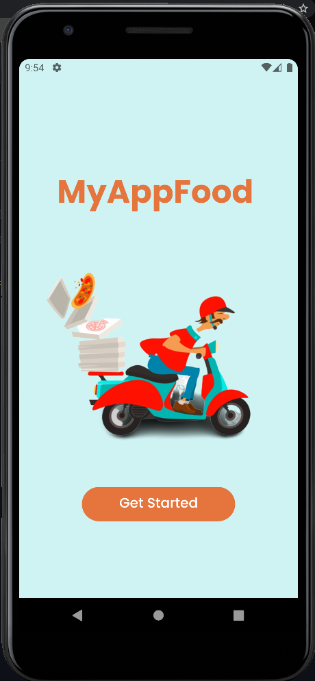
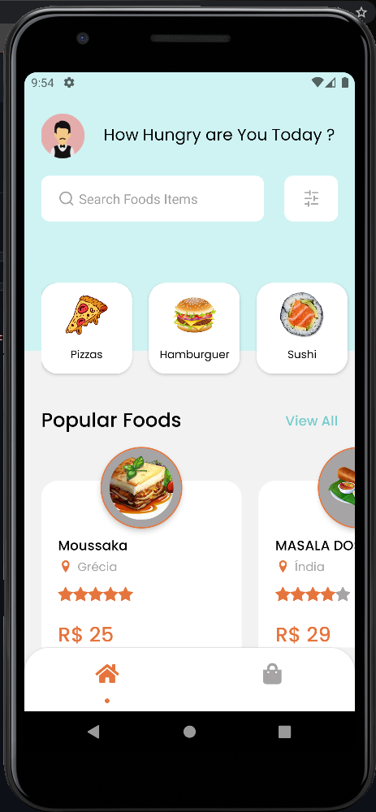
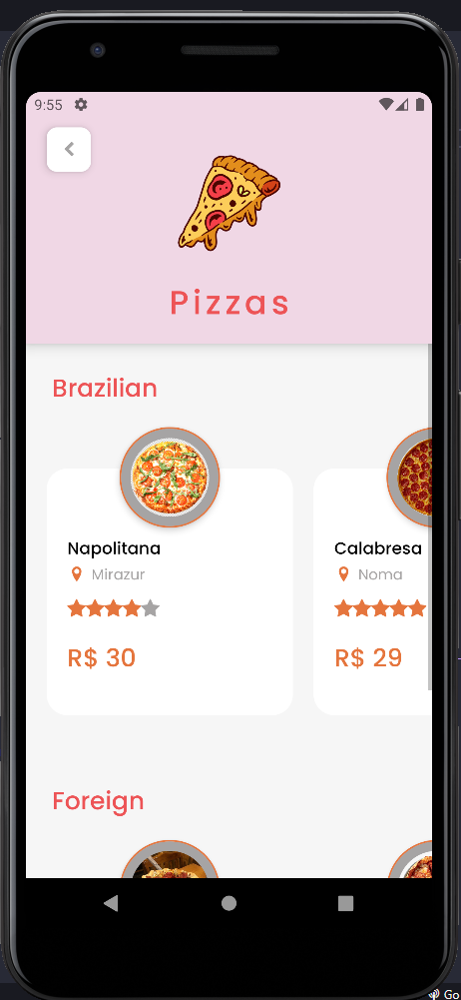
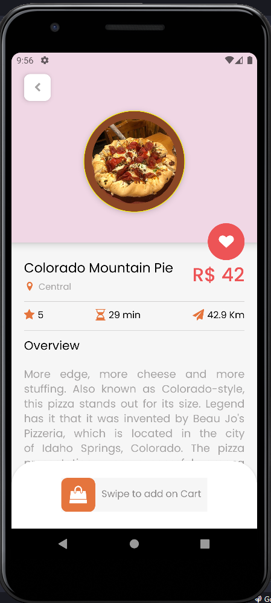
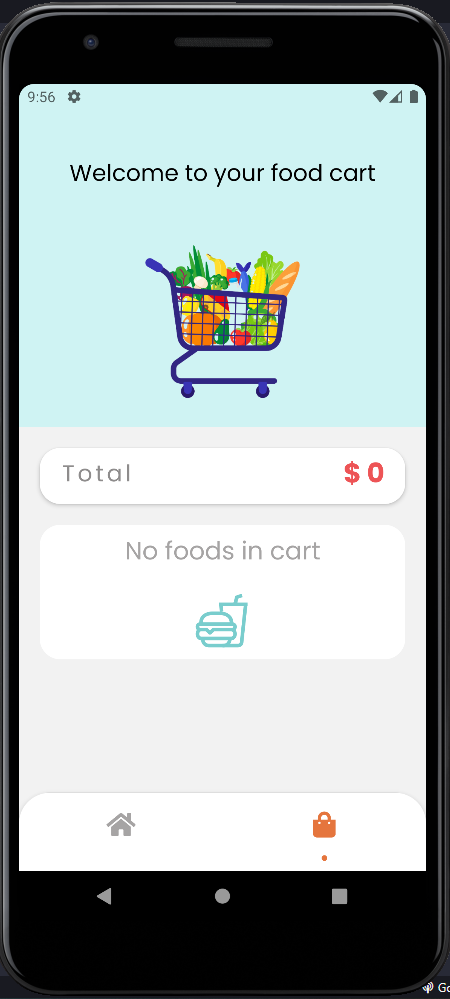
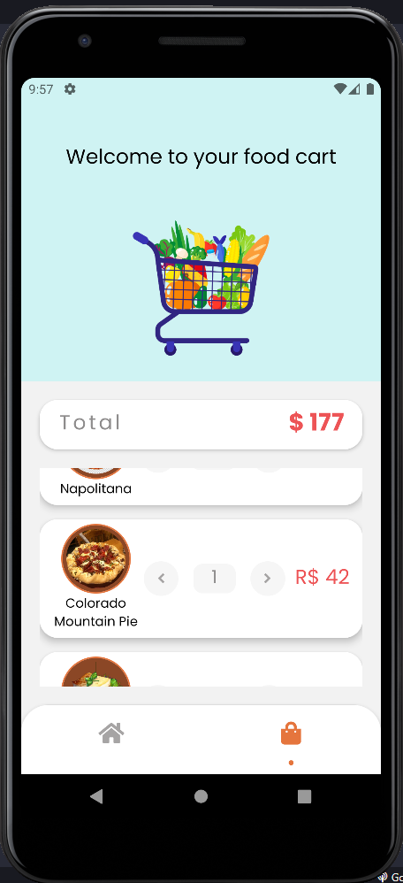

# MyAppFood 💭

Repositório do projeto **MyAppFood** desenvolvido para aprofundar os conhecimentos em React Native, Redux, Redux-Persist, TypeScript, Styled-Components, e demais libs do React-Native.

<h3 id="preview">🎥 Preview</h3>

&nbsp;&nbsp;&nbsp;&nbsp;&nbsp;&nbsp;&nbsp;&nbsp;&nbsp;&nbsp;&nbsp;&nbsp;&nbsp;&nbsp;&nbsp;&nbsp;&nbsp;&nbsp;&nbsp;&nbsp;

&nbsp;&nbsp;&nbsp;&nbsp;&nbsp;&nbsp;&nbsp;&nbsp;&nbsp;&nbsp;&nbsp;&nbsp;&nbsp;&nbsp;&nbsp;&nbsp;&nbsp;&nbsp;&nbsp;&nbsp;

&nbsp;&nbsp;&nbsp;&nbsp;&nbsp;&nbsp;&nbsp;&nbsp;

&nbsp;&nbsp;&nbsp;&nbsp;&nbsp;&nbsp;&nbsp;&nbsp;&nbsp;&nbsp;&nbsp;&nbsp;&nbsp;&nbsp;&nbsp;&nbsp;&nbsp;&nbsp;&nbsp;&nbsp;

&nbsp;&nbsp;&nbsp;&nbsp;&nbsp;&nbsp;&nbsp;&nbsp;&nbsp;&nbsp;&nbsp;&nbsp;&nbsp;&nbsp;&nbsp;&nbsp;&nbsp;&nbsp;&nbsp;&nbsp;

<h3 id="acessar-projeto">📁 Inicialização da Clonagem</h3>

◽ Clonar o repositório ultilizando Git Bash + o comando:

       $ git clone https://github.com/IMatheusPiresI/foodapp.git

◽ Acessar a pasta to-ducks-tasks e executar o comando  

        $ yarn

◽ Após a instalação das dependências, rodar o comando:   

        $ yarn run android
        
◽ Para iniciar a API do json-server, deve-se abrir outro terminal e rodar o comando:   

        $ yarn api

<h3 id="tecnologias">⚙️ Tecnologias Utilizadas</h3>

  
  
  
  

<h3 id="sobre">📍 Sobre</h3>

✅ Desenvolvido com React Native, Redux, Redux-Persist, Typescript, Styled-Components, Duck Pattern, React Hooks.  
✅ Dados de transações criadas são salvos no AsyncStorage pelo redux-persist.  
✅ Utilizado json-server para simular uma API e poder trabalhar com as requisições assíncronas.  
✅ Carrinho de compras para adicionar os pedidos, todos os pedidos são salvos em localstorage.  

<h3 id="status">📌 Status do projeto</h3>

Finalizado e recebendo feedbacks. ✔

<h3 id="autor">✒️ Autor</h3>

[Clique aqui](https://matheuspires.vercel.app)🔗 e acesse meu portfólio!  

  
